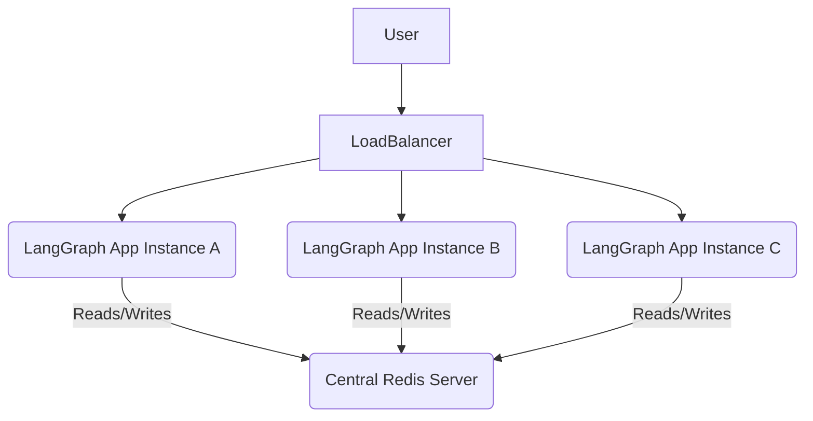

## LangGraph Memory Implementation with Redis: Production-Ready Tutorial

Building smart applications often means remembering past conversations. LangGraph helps you create powerful, stateful agents that need a good memory. But what if your application grows and many users talk to it at the same time?

This is where a robust memory solution like Redis becomes essential. In this guide, you will learn all about `langgraph redis memory implementation` to make your applications fast, scalable, and ready for anything. We will cover everything from basic setup to advanced production strategies.

### Understanding LangGraph Memory

Imagine your LangGraph agent is like a person having a chat. To have a sensible conversation, it needs to remember what was said before. This "remembering" part is what we call memory in LangGraph.

Memory helps your agent maintain context and build on previous interactions. Without memory, every chat would feel like the very first one, which isn't very helpful. LangGraph needs to store its internal state for each conversation.

When you run a LangGraph agent, its state includes all the information it has gathered so far. This state is often stored temporarily in your computer's memory. However, this simple approach quickly hits limits in real-world applications.

### Why Redis is Perfect for LangGraph Memory

When your application needs to handle many users, or if it runs on several computers, a simple in-memory solution won't work. You need a way to share and save that memory reliably. This is where Redis comes in as a fantastic choice for `langgraph redis memory implementation`.

Redis is a super-fast, open-source database that stores data in memory. It's like a special, quick storage locker for your application's brain. Redis isn't just fast; it's also very flexible and can handle many different types of data.

It's known for its low latency and high throughput, which means it can read and write data incredibly quickly. This speed is crucial for keeping your LangGraph applications snappy and responsive. Redis is also designed for production, offering features like data persistence and high availability.

### Redis Basics for LangGraph

Before diving into how to use Redis with LangGraph, let's briefly touch upon some `Redis basics for LangGraph`. Redis stores data in a key-value format, much like a dictionary. You give it a unique name (the key) and store some information (the value) under that name.

LangGraph will store its conversation state as values, identified by unique keys, usually related to the chat ID. Redis supports various data structures like strings, hashes, lists, and sets. For LangGraph's state, Redis hashes are often used to store structured information about a session.

Imagine each conversation with your LangGraph agent gets its own unique key in Redis. Under that key, Redis stores a collection of details about that specific conversation. This might include the last message, current agent state, or any variables your agent is tracking.

### Setting Up Redis for LangGraph

Getting Redis up and running locally is quite simple, especially using Docker. Docker lets you run Redis in an isolated environment without installing it directly on your system. This is a great way to start experimenting with `langgraph redis memory implementation`.

If you don't have Docker installed, you can find instructions on the [official Docker website](https://docs.docker.com/get-docker/). Once Docker is ready, you can launch a Redis instance with a single command. This command pulls the latest Redis image and runs it.

```bash
docker run --name my-redis -p 6379:6379 -d redis
```

This command starts a Redis server and makes it available on port 6379 of your computer. The `--name my-redis` gives it a friendly name, and `-d` runs it in the background. Now, you have a running Redis server ready for your LangGraph application.

For a more robust local setup, especially if you need other services, a `docker-compose.yml` file is very handy. This file lets you define multiple services and how they connect. Here's a simple example for Redis.

```yaml
# docker-compose.yml
version: '3.8'
services:
  redis:
    image: redis:latest
    container_name: langgraph-redis
    ports:
      - "6379:6379"
    volumes:
      - redis_data:/data # This will persist Redis data
    command: redis-server --appendonly yes # Enable AOF persistence
volumes:
  redis_data:
```

Save this content as `docker-compose.yml` in a folder and run `docker-compose up -d`. This will start Redis and even configure it for basic data persistence, which we'll discuss later. You now have a reliable Redis server for your `langgraph redis memory implementation`.

### Introducing RedisSaver: The Key to `langgraph redis memory implementation`

LangGraph itself provides a convenient way to integrate with external memory solutions. For Redis, this solution is often the `RedisSaver` class. The `RedisSaver` is part of the LangChain ecosystem and acts as a bridge between your LangGraph state and your Redis database.

Think of `RedisSaver` as a special messenger. When your LangGraph agent needs to save its thoughts, the messenger takes them and stores them in Redis. When the agent needs to remember something, the messenger fetches it from Redis. It handles all the complex interactions with Redis for you.

To use `RedisSaver`, you first need to install the necessary Python packages. You'll need `langgraph` and `redis` (the `redis-py` client library). This ensures your Python code can talk to your Redis server.

```bash
pip install langgraph redis
```

Once installed, you can import and configure `RedisSaver`. The most basic `RedisSaver configuration` involves telling it where your Redis server is located. This typically means providing the host and port number.

```python
from langchain_core.runnables.history import RedisSaver
import redis

# Create a Redis client instance
# For local setup, host='localhost', port=6379 is common
redis_client = redis.Redis(host='localhost', port=6379, db=0)

# Instantiate RedisSaver with the client
message_history = RedisSaver(client=redis_client)
```

In this snippet, `redis.Redis` creates a connection to your Redis server. Then, `RedisSaver` uses this connection to save and load your LangGraph's state. You'll typically pass this `message_history` object to your LangGraph's `with_message_history` method.

### Practical `langgraph redis memory implementation` Example

Let's put `RedisSaver` into action with a simple LangGraph example. Imagine a very basic chatbot that remembers your name. This example will show you how to set up a graph and connect it to Redis.

First, we need to define our graph. For simplicity, we'll use a single node that processes user input. The important part is how we integrate `RedisSaver` for persistent state.

```python
from langgraph.graph import StateGraph, END
from langchain_core.messages import HumanMessage, AIMessage
from langchain_core.prompts import ChatPromptTemplate
from langchain_openai import ChatOpenAI
from langchain_core.runnables.history import RedisSaver
import redis
import os

# Make sure you have your OpenAI API key set as an environment variable
# os.environ["OPENAI_API_KEY"] = "YOUR_OPENAI_KEY"

# Define the state for our graph
class AgentState:
    messages: list

# Define a simple node for processing messages
def call_model(state: AgentState):
    messages = state["messages"]
    model = ChatOpenAI(temperature=0)
    prompt = ChatPromptTemplate.from_messages([
        ("system", "You are a helpful AI assistant. Remember user's name."),
        ("human", "{input}"),
    ])
    # For a real chatbot, you'd pass the entire history
    # For this simple example, we'll just process the last message for simplicity
    # and let RedisSaver handle the full message history
    response = model.invoke(prompt.format(input=messages[-1].content))
    return {"messages": [AIMessage(content=response.content)]}

# Build the graph
builder = StateGraph(AgentState)
builder.add_node("chatbot", call_model)
builder.set_entry_point("chatbot")
builder.set_finish_point("chatbot")

# Compile the graph
app = builder.compile()

# Connect to Redis
redis_client = redis.Redis(host='localhost', port=6379, db=0)
message_history = RedisSaver(client=redis_client)

# Define a unique session ID for our conversation
# In a real app, this would come from a user ID or session token
thread_id = "my_first_chat_session"

# Wrap the graph with message history, using our RedisSaver
# The `thread_id` is crucial for `session management with Redis`
graph_with_history = app.with_message_history(
    message_history,
    input_messages_key="messages",
    output_messages_key="messages",
    history_messages_key="messages",
    # You can specify a custom key prefix if needed, e.g., "my_app_prefix:"
    # This helps organize keys in Redis, which is good practice.
    # The actual key used will be something like "my_app_prefix:my_first_chat_session"
    key_prefix="langgraph_sessions:" 
)

print(f"Starting chat session: {thread_id}")

# First interaction
print("\n--- First Interaction ---")
inputs = {"messages": [HumanMessage(content="Hi, my name is Alice.")]}
result = graph_with_history.invoke(inputs, config={"configurable": {"thread_id": thread_id}})
print(f"AI: {result['messages'][-1].content}")

# Second interaction in the same session
print("\n--- Second Interaction ---")
inputs = {"messages": [HumanMessage(content="What is my name?")]}
result = graph_with_history.invoke(inputs, config={"configurable": {"thread_id": thread_id}})
print(f"AI: {result['messages'][-1].content}")

# Now let's try a new session to show isolation
new_thread_id = "new_user_session_bob"
print(f"\n--- New User Session: {new_thread_id} ---")
inputs = {"messages": [HumanMessage(content="Hello, I am Bob.")]}
result_bob = graph_with_history.invoke(inputs, config={"configurable": {"thread_id": new_thread_id}})
print(f"AI: {result_bob['messages'][-1].content}")

inputs = {"messages": [HumanMessage(content="What is my name?")]}
result_bob_2 = graph_with_history.invoke(inputs, config={"configurable": {"thread_id": new_thread_id}})
print(f"AI: {result_bob_2['messages'][-1].content}")

# To verify, you can check Redis:
# In your terminal, run `docker exec -it langgraph-redis redis-cli`
# Then `KEYS langgraph_sessions:*` to see the session keys
# And `HGETALL langgraph_sessions:my_first_chat_session` to see Alice's history
# And `HGETALL langgraph_sessions:new_user_session_bob` to see Bob's history
```

In this example, each call to `graph_with_history.invoke` with the same `thread_id` will load the previous state from Redis. The `RedisSaver` handles saving the updated state back to Redis after the graph runs. If you restart your Python script, the conversation history for `thread_id` will still be in Redis, ready to be loaded. This demonstrates persistent `langgraph redis memory implementation`.

### Advanced RedisSaver Configuration

Beyond the basic host and port, `RedisSaver` offers more options for fine-tuning its behavior. Understanding these can help you optimize your `langgraph redis memory implementation` for production. You can pass a pre-configured `redis-py` client, which gives you more control.

One important aspect in production is `connection pooling`. When many parts of your application try to talk to Redis at the same time, opening and closing connections repeatedly can be slow. Connection pooling keeps a set of open connections ready to use.

The `redis-py` library, which `RedisSaver` uses, automatically manages a connection pool. You can configure this pool by passing specific parameters when creating your `redis.Redis` client. This helps your application handle many requests efficiently without overwhelming Redis.

```python
import redis
from langchain_core.runnables.history import RedisSaver

# Configure a connection pool with a max of 10 connections
pool = redis.ConnectionPool(host='localhost', port=6379, db=0, max_connections=10)
redis_client_with_pool = redis.Redis(connection_pool=pool)

# Now, create RedisSaver using this client
message_history_pooled = RedisSaver(client=redis_client_with_pool)

# You would then pass `message_history_pooled` to your graph.with_message_history()
```

By explicitly configuring the connection pool, you ensure that your `langgraph redis memory implementation` is ready for high-traffic scenarios. This is a critical step for making your application production-ready. You can also specify other client settings like `timeout` for connections, or `decode_responses=True` if you want Redis to automatically decode byte responses to strings.

### Session Management with Redis

In any real-world application, you'll have multiple users, each with their own ongoing conversation. `Session management with Redis` is crucial to keep these conversations separate and consistent. LangGraph uses a `thread_id` to identify unique conversations.

When you use `RedisSaver`, each `thread_id` corresponds to a unique key in Redis. This means Alice's conversation history is stored under one key, and Bob's under another. This isolation ensures that one user's interaction doesn't mix with another's.

```python
# From the previous example:
# graph_with_history.invoke(inputs, config={"configurable": {"thread_id": thread_id}})
```

The `thread_id` in the `config` dictionary is the magic string that `RedisSaver` uses to identify and manage each session. It saves the state associated with `thread_id` and loads it when the same `thread_id` is used again. This pattern is fundamental for building multi-user LangGraph applications.

Proper `session management with Redis` means you can scale your application without worrying about memory conflicts. Each user gets their own dedicated memory space, ensuring a personalized and continuous experience. It's like giving each customer their own private locker for their belongings.

### Distributed State Handling

What if your LangGraph application is so popular that you need to run it on multiple servers? This is a common scenario in production environments, often handled by load balancers. In such a setup, `distributed state handling` becomes a necessity.

Imagine three different server instances, all running your LangGraph agent. A user sends a message, and it might hit server A. Their next message might go to server B. If the memory was only on server A, server B wouldn't know anything about the previous conversation. This would break the user experience.

Redis solves this problem by providing a centralized, shared memory store. All your LangGraph instances (servers A, B, and C) can connect to the *same* Redis instance. When a state is saved by server A, server B can retrieve it, ensuring a seamless conversation regardless of which server handles the request.



This diagram shows how Redis acts as the single source of truth for your LangGraph's state across multiple application instances. This architecture is crucial for building horizontally scalable applications. It ensures that your `langgraph redis memory implementation` can support a growing number of users without losing state.

### Redis Cluster Setup for High Availability

While a single Redis instance works great for `distributed state handling`, it has a single point of failure. If that one Redis server goes down, your entire application loses its memory. For true production readiness, you need a `Redis cluster setup`.

A Redis Cluster is a distributed implementation of Redis that provides automatic sharding and high availability. "Sharding" means your data is split across multiple Redis nodes. This allows for storing much larger datasets than a single server can handle.

"High availability" means that if one Redis node fails, the cluster continues to operate. This is achieved through replication, where each piece of data is stored on a "master" node and also copied to one or more "replica" nodes. If a master fails, a replica can automatically take its place.

Setting up a full Redis Cluster can be complex, but here's a conceptual `docker-compose.yml` for a 6-node cluster (3 masters, 3 replicas) to illustrate the idea:

```yaml
# Simplified example for a Redis Cluster setup
version: '3.8'
services:
  redis-node-1:
    image: redis:7
    command: redis-server /usr/local/etc/redis/redis.conf --appendonly yes --cluster-enabled yes --cluster-config-file nodes-6379.conf --port 6379
    volumes:
      - ./redis_conf/redis.conf:/usr/local/etc/redis/redis.conf
      - redis-data-1:/data
    ports:
      - "6379:6379"
    environment:
      - REDIS_PORT=6379
  redis-node-2:
    image: redis:7
    command: redis-server /usr/local/etc/redis/redis.conf --appendonly yes --cluster-enabled yes --cluster-config-file nodes-6380.conf --port 6380
    volumes:
      - ./redis_conf/redis.conf:/usr/local/etc/redis/redis.conf
      - redis-data-2:/data
    ports:
      - "6380:6380"
    environment:
      - REDIS_PORT=6380
  # ... (repeat for redis-node-3, redis-node-4, redis-node-5, redis-node-6 on ports 6381-6384)

# You would also need a `redis.conf` file with cluster-specific settings
# and then use `redis-cli --cluster create` to form the cluster.

volumes:
  redis-data-1:
  redis-data-2:
  # ... (repeat for other nodes)
```

For connecting `RedisSaver` to a Redis Cluster, you would use the `RedisCluster` client from the `redis-py-cluster` library (or `redis-py` has `redis.RedisCluster` in newer versions). This client understands how to talk to a cluster, finding the right node for each piece of data.

```python
# pip install redis-py-cluster or ensure redis-py is recent enough for RedisCluster
from redis.cluster import RedisCluster
from langchain_core.runnables.history import RedisSaver

# Specify initial nodes of your cluster
startup_nodes = [
    {"host": "127.0.0.1", "port": "6379"},
    {"host": "127.0.0.1", "port": "6380"},
    # ... add other cluster nodes
]

# Create a RedisCluster client
redis_cluster_client = RedisCluster(startup_nodes=startup_nodes, decode_responses=True)

# Instantiate RedisSaver with the cluster client
message_history_cluster = RedisSaver(client=redis_cluster_client)

# Use message_history_cluster with your LangGraph application
```

This `Redis cluster setup` provides enterprise-grade reliability and scalability for your `langgraph redis memory implementation`. It ensures that your application remains available even during hardware failures, a key aspect of `high-availability patterns`.

### Caching Strategies with Redis

Redis isn't just for primary memory; it's also excellent for `caching strategies`. Beyond storing your LangGraph's active state, you can use Redis to speed up other parts of your application. For example, if your LangGraph frequently asks an LLM the same question, you can cache those LLM responses.

Imagine your agent sometimes asks for the current weather in a city. If many users ask for the weather in the same city within a short period, you don't need to hit the external weather API every time. You can store the answer in Redis for a few minutes.

```python
import redis
import json
import time

redis_client = redis.Redis(host='localhost', port=6379, db=0)

def get_weather_data(city):
    cache_key = f"weather_cache:{city}"
    cached_data = redis_client.get(cache_key)

    if cached_data:
        print(f"Returning cached weather for {city}")
        return json.loads(cached_data)
    
    print(f"Fetching fresh weather for {city}...")
    # Simulate an expensive API call
    time.sleep(2) 
    fresh_data = {"city": city, "temperature": "25C", "condition": "Sunny", "timestamp": time.time()}
    
    # Store in cache for 300 seconds (5 minutes)
    redis_client.setex(cache_key, 300, json.dumps(fresh_data)) 
    return fresh_data

# Example usage
print(get_weather_data("London"))
print(get_weather_data("London")) # This will be served from cache
time.sleep(301) # Wait for cache to expire
print(get_weather_data("London")) # This will fetch fresh data again
```

This simple caching decorator demonstrates how Redis can be used to store results of expensive operations. This strategy reduces costs, improves response times, and decreases load on external services. It's a powerful tool in your `langgraph redis memory implementation` toolkit.

### TTL Configuration for Memory Management

Over time, conversation histories can grow very large, consuming a lot of Redis memory. Not all conversations need to be remembered forever. This is where `TTL configuration` (Time To Live) becomes incredibly useful. TTL allows you to set an expiration time for keys in Redis.

When a key's TTL expires, Redis automatically deletes it. This is perfect for managing older LangGraph sessions that are no longer active. You can decide to keep a user's chat history for, say, 24 hours, 7 days, or even just a few hours. This prevents your Redis database from endlessly growing.

While `RedisSaver` itself doesn't have a direct `ttl` parameter when instantiated, you can set the TTL on the keys it creates after the state has been saved. The keys used by `RedisSaver` follow a pattern like `key_prefix:thread_id`.

```python
import redis
from langchain_core.runnables.history import RedisSaver
from langgraph.graph import StateGraph, END
from langchain_core.messages import HumanMessage, AIMessage

# ... (Assume app and redis_client are defined as in the earlier example) ...

redis_client = redis.Redis(host='localhost', port=6379, db=0)
message_history = RedisSaver(client=redis_client, key_prefix="langgraph_sessions:")

class AgentState:
    messages: list

def call_model(state: AgentState):
    # Simulate agent processing
    return {"messages": [AIMessage(content="I'm a simple AI.")]}

builder = StateGraph(AgentState)
builder.add_node("chatbot", call_model)
builder.set_entry_point("chatbot")
builder.set_finish_point("chatbot")
app = builder.compile()

graph_with_history = app.with_message_history(
    message_history,
    input_messages_key="messages",
    output_messages_key="messages",
    history_messages_key="messages",
    key_prefix="langgraph_sessions:" 
)

session_to_expire = "ephemeral_session_123"
inputs = {"messages": [HumanMessage(content="Hello, expire soon.")]}
graph_with_history.invoke(inputs, config={"configurable": {"thread_id": session_to_expire}})

# Get the actual key used by RedisSaver
redis_key_for_session = f"langgraph_sessions:{session_to_expire}"

# Set a TTL of 60 seconds for this session's memory
redis_client.expire(redis_key_for_session, 60) 
print(f"Session '{session_to_expire}' set to expire in 60 seconds.")

# You can check its TTL
print(f"TTL for {redis_key_for_session}: {redis_client.ttl(redis_key_for_session)} seconds")

# After 60 seconds, the key will automatically be deleted by Redis.
# You could run `redis_client.get(redis_key_for_session)` to verify it becomes None.
```

By strategically using `TTL configuration`, you can automatically clean up old data, keeping your Redis memory usage under control. This is a crucial practice for maintaining an efficient and cost-effective `langgraph redis memory implementation` in production.

### Redis Persistence Options

What happens to your LangGraph's memory if your Redis server restarts, or if the power goes out? By default, Redis stores everything in memory, so a restart would wipe out all your conversation histories. For production, you need to enable `Redis persistence options`.

Redis offers two main ways to save data to disk: RDB (Redis Database) and AOF (Append Only File). Both have their advantages and disadvantages for `langgraph redis memory implementation`. Choosing the right one depends on how critical your data is and how much data loss you can tolerate.

**RDB (Redis Database)**
RDB persistence takes periodic "snapshots" of your dataset at specified intervals. It's like taking a photo of your entire Redis memory at certain times.
*   **Pros:** Very compact files, fast to start up, good for disaster recovery.
*   **Cons:** You might lose some data between the last snapshot and a crash. If your last snapshot was 5 minutes ago, you lose 5 minutes of data.
*   **Configuration in `redis.conf`:**
    ```
    save 900 1    # Save if 1 key changed in 900 seconds (15 min)
    save 300 10   # Save if 10 keys changed in 300 seconds (5 min)
    save 60 10000 # Save if 10000 keys changed in 60 seconds (1 min)
    dbfilename dump.rdb
    dir ./
    ```

**AOF (Append Only File)**
AOF persistence logs every write operation received by the server. It's like a journal of all the commands that changed your data. To restore, Redis simply replays these commands.
*   **Pros:** More durable, meaning less data loss (you can configure how often it writes to disk).
*   **Cons:** Larger file size, potentially slower to restore, especially for very large datasets.
*   **Configuration in `redis.conf`:**
    ```
    appendonly yes
    appendfsync everysec # fsyncs every second (good balance of performance and durability)
    # appendfsync always # fsyncs on every write (slow but ensures no data loss)
    # appendfsync no     # Redis relies on OS for syncing (fast but more data loss risk)
    dir ./
    ```

For most `langgraph redis memory implementation` scenarios, `appendfsync everysec` with AOF offers a good balance. It provides strong durability with minimal performance impact. If data loss is absolutely unacceptable, `appendfsync always` can be considered, but be aware of the performance cost. You can also combine RDB and AOF for maximum data safety.

### High-Availability Patterns Beyond Clustering

While Redis Cluster offers significant `high-availability patterns`, there are other strategies and considerations, especially for disaster recovery or specific deployment needs. Understanding these ensures your `langgraph redis memory implementation` is truly fault-tolerant.

**Redis Sentinel:**
Sentinel is a separate system designed to monitor your Redis master and replica instances. If the master fails, Sentinel can automatically promote a replica to become the new master. This is perfect for single master-multiple replica setups that don't need the sharding capabilities of a cluster but still require automatic failover.
*   **Benefit:** Simpler to set up than a full cluster, provides automatic failover for non-sharded deployments.
*   **Use case:** When your data fits on a single Redis server but you need continuous availability.

**Geographic Distribution and Disaster Recovery:**
For extreme resilience, you might deploy Redis instances across different data centers or geographic regions. This protects your data even if an entire region experiences an outage. Tools like Redis Enterprise (a commercial version) or custom scripting can help synchronize data across these distributed instances.
*   **Benefit:** Protects against large-scale regional failures.
*   **Use case:** Mission-critical applications where downtime is extremely costly.

**Backup and Restore Strategies:**
Regardless of your persistence and high-availability choices, regular backups are essential. You can schedule regular copies of your RDB files or AOF files to offsite storage. In the event of a catastrophic data corruption, these backups can be used to restore your `langgraph redis memory implementation` to a previous healthy state.
*   **Benefit:** Recovers from logical data corruption (e.g., accidental deletion) that persistence/replication might propagate.
*   **Tools:** Standard backup utilities, cloud provider backup services.

By combining these patterns, you can design a Redis setup that meets the most stringent availability requirements for your LangGraph applications. This layered approach to `high-availability patterns` is critical for production systems.

### Best Practices for `langgraph redis memory implementation`

To ensure your Redis-backed LangGraph application runs smoothly and securely, consider these best practices:

*   **Security:**
    *   **Authentication:** Always protect your Redis instance with a strong password. This is configured in `redis.conf` with the `requirepass` directive.
    *   **Network Isolation:** Never expose your Redis server directly to the public internet. Use firewalls, VPNs, or private networks to restrict access only to your application servers.
    *   **TLS/SSL:** For sensitive data, enable TLS encryption for connections between your application and Redis. This prevents eavesdropping.

*   **Monitoring:**
    *   **Key Metrics:** Keep an eye on Redis metrics like memory usage, CPU usage, connected clients, hit/miss ratio for cache, and latency.
    *   **Tools:** Use monitoring tools like Prometheus and Grafana, or cloud provider monitoring services. Early alerts can prevent outages.

*   **Capacity Planning:**
    *   **Memory:** Estimate how much memory your LangGraph sessions will consume. Each session's state is stored in Redis. Plan for peak usage and account for AOF/RDB files.
    *   **CPU/Network:** Redis is fast, but heavy traffic will consume CPU and network bandwidth. Benchmark your application to understand its needs.

*   **Error Handling:**
    *   **Connection Errors:** Your application should gracefully handle situations where it temporarily loses connection to Redis. Implement retries with exponential backoff.
    *   **Command Errors:** Handle potential Redis command errors (e.g., trying to operate on a non-existent key, which `RedisSaver` generally manages, but good to know for custom Redis usage).

*   **Key Naming and TTLs:**
    *   **Consistent Key Prefixes:** Use a consistent `key_prefix` (e.g., `my_app_name:langgraph_sessions:`) in `RedisSaver` for better organization and easier management.
    *   **Appropriate TTLs:** Apply TTLs to session data that doesn't need to live forever. This prevents memory bloat and keeps Redis performant.

*   **Resource Management:**
    *   **Connection Pooling:** As discussed, use connection pooling to manage connections efficiently and reduce overhead.
    *   **Pipeline/Transactions:** For multiple Redis commands that need to run together, consider using Redis pipelines or transactions to reduce round-trip times and ensure atomicity.

By following these best practices, your `langgraph redis memory implementation` will be not only functional but also robust, secure, and ready for the demands of a production environment.

### Conclusion

You've now taken a deep dive into `langgraph redis memory implementation`, transforming a simple in-memory system into a production-ready powerhouse. You understand why Redis is a perfect fit for persistent and scalable LangGraph memory. We covered `Redis basics for LangGraph`, setting up Redis, and integrating `RedisSaver configuration` into your application.

We also explored critical concepts like `session management with Redis` and `distributed state handling`, which are vital for multi-user and multi-instance deployments. For ultimate reliability, you learned about `Redis cluster setup` and other `high-availability patterns`. Furthermore, you now know how to optimize Redis with `caching strategies`, manage data lifecycle with `TTL configuration`, and ensure data safety with `Redis persistence options`.

By implementing these strategies, your LangGraph applications will be able to remember complex conversations, handle many users simultaneously, and remain available even under challenging conditions. Start building your scalable AI agents today with the confidence that Redis provides a solid foundation for their memory.

You can learn more about LangGraph's capabilities in [our introductory guide to LangGraph basics] (Link to your blog post on LangGraph Basics). For deeper insights into advanced LangChain features, check out [our blog post on custom LangChain components] (Link to your blog post on advanced LangChain features).