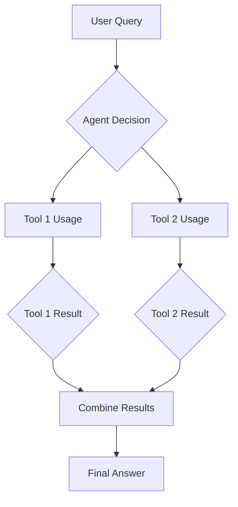

## Build Multi-Tool AI Agents: LangChain Agents with Tools Tutorial 2026

Imagine a super-smart helper that can do many different jobs for you. This helper isn't just good at one thing, like writing a story or doing math. It can use all sorts of special tools to solve big problems. We are talking about multi-tool AI agents built with LangChain, and they are becoming even more amazing as we look towards 2026.

You are about to learn how to create these powerful AI agents yourself. This guide will walk you through building multi-tool AI agents using LangChain. We will show you how these agents can combine multiple tools to tackle complex tasks.

### What are Multi-Tool AI Agents?

Think of a robot with a whole toolbox, not just a hammer. This robot can pick the right tool – maybe a wrench, a screwdriver, or even a measuring tape – to get a job done. A multi-tool AI agent is very similar, but its "tools" are computer programs or functions. It's an AI that knows how to use different software tools to achieve a goal.

These agents don't just "talk" or "write." They can search the internet, do calculations, send emails, or even interact with other apps. They do this by combining multiple tools in a smart way. This ability makes them incredibly powerful and flexible for many tasks you might have.

### Why Multi-Tool AI Agents Matter for You

Life is full of tasks that need more than one step or skill. Booking a trip involves searching for flights, checking hotel prices, and looking up the weather. Doing all these things with just one simple AI is tough.

Multi-tool AI agents can handle these multi-step challenges with ease. They can break down a big problem into smaller pieces and use the right tool for each part. This makes your work faster and much more efficient.

### LangChain: Your Blueprint for Building Smart Agents

LangChain is like a special building kit for AI agents. It gives you all the pieces and instructions to connect a smart AI "brain" with many different tools. You can teach your multi-tool AI agents langchain to use a variety of functions easily.

It helps you design how your agent thinks, what tools it has, and how it decides which tool to use. Without LangChain, building these complex agents would be much harder. It simplifies the whole process for you. For more information, you can always check out [LangChain's official documentation](https://www.langchain.com).

### The Core Parts of a Multi-Tool AI Agent

To understand how multi-tool AI agents work, let's look at their main components. These are the basic building blocks that make up your smart assistant. Each part plays a crucial role in the agent's ability to perform tasks.

#### The Brain: Large Language Models (LLMs)

At the heart of every LangChain agent is a Large Language Model (LLM). This is the "brain" that understands your commands and figures out how to respond. It's what allows the agent to read, write, and think.

The LLM is key to the agent's tool selection logic. It processes your request and decides which tools are needed. Without a powerful LLM, the agent wouldn't know how to use its tools effectively.

#### The Toolkit: Tools

Tools are like the hands and specialized equipment of your AI agent. A tool is a specific function or program that the agent can call upon. It performs an action outside of what the LLM can do by itself.

Examples include a "Google Search Tool" to find information, a "Calculator Tool" to do math, or even a "Database Query Tool" to pull specific data. You can create your own custom tools for almost any task. Understanding how to build and integrate these tools is fundamental for multi-tool AI agents langchain.

#### The Planner: Agents

The agent itself is the part that combines the LLM brain with the toolkit. It uses the LLM to think about the task, decide which tools to use, and in what order. The agent then takes action by calling those tools.

LangChain provides different types of agents, each with a slightly different way of thinking. You will learn how to choose the right agent type for your specific multi-tool agent architecture. Agents are the orchestrators of the entire workflow.

#### The Memory: Remembering Things

Imagine trying to have a conversation where you forget everything that was just said. That's how an AI would be without memory. Memory allows the agent to remember past interactions and use that information in current decisions.

This is super important for complex workflow agents that need to follow many steps. It helps with context sharing between tools and ensures the agent stays on track. Memory makes the agent's conversations and actions much more natural and efficient. If you want to dive deeper into memory, check out our guide on [persistent memory for AI agents](/blog/persistent-ai-agent-memory.md).

### Setting Up Your LangChain Environment

Before we build any multi-tool AI agents langchain, you need to set up your workspace. This involves installing LangChain and any other necessary libraries. Don't worry, it's pretty straightforward.

First, you'll need Python installed on your computer. If you don't have it, you can get it from [Python's official website](https://www.python.org/). Once Python is ready, open your terminal or command prompt.

```bash
# Install LangChain
pip install langchain langchain-community langchain-openai
```

You might also need to install a specific LLM library, like `openai` for OpenAI models. You'll also need an API key for your chosen LLM provider. Keep this key safe and never share it publicly.

```python
import os
os.environ["OPENAI_API_KEY"] = "YOUR_OPENAI_API_KEY" # Replace with your actual key
```

### Building Your First Tools for Multi-Tool AI Agents

Let's create some simple tools that your multi-tool AI agents langchain can use. These tools will perform specific, small tasks. You can imagine them as basic functions your agent can call.

#### H3: Example Tool 1: The Calculator

A calculator is a classic example of a useful tool. Your AI can't do complex math perfectly on its own, but it can use a calculator tool. This tool will take a math problem and give back the answer.

We'll use LangChain's built-in `ArithmeticsTool` for simplicity, but you could write your own Python function. This shows how straightforward adding capabilities can be. It's a fundamental part of multi-tool agent architecture.

```python
from langchain.agents import AgentExecutor, create_react_agent
from langchain_community.tools.base import BaseTool
from langchain_openai import ChatOpenAI
from langchain import hub
from typing import Type
from pydantic import BaseModel, Field

# Define a custom input schema for a tool
class CalculatorInput(BaseModel):
    expression: str = Field(description="mathematical expression to evaluate")

class MyCalculatorTool(BaseTool):
    name: "calculator"
    description: "useful for when you need to answer questions about math"
    args_schema: Type[BaseModel] = CalculatorInput

    def _run(self, expression: str):
        try:
            return str(eval(expression))
        except Exception as e:
            return f"Error evaluating expression: {e}"

    async def _arun(self, expression: str):
        """Async version of the tool."""
        raise NotImplementedError("Calculator tool does not support async")

# Make an instance of our custom calculator tool
calculator_tool = MyCalculatorTool()
print("Calculator tool created.")
```

You just defined a basic calculator tool for your agent. This is an essential step in building multi-tool AI agents. You can now imagine how to add other capabilities too.

#### H3: Example Tool 2: The "Get Current Time" Tool

Knowing the current time is a simple but often useful task. Your AI agent can use a tool to fetch this information instantly. This demonstrates how to create a tool that interacts with your system's capabilities.

This helps illustrate context sharing between tools when the time might be needed for another action. It also shows a simple, self-contained tool. Here’s how you define it:

```python
import datetime

class GetTimeInput(BaseModel):
    pass # No specific input needed for this tool

class GetCurrentTimeTool(BaseTool):
    name: "get_current_time"
    description: "useful for when you need to know the current date and time"
    args_schema: Type[BaseModel] = GetTimeInput

    def _run(self, *args, **kwargs):
        """Get the current date and time."""
        return datetime.datetime.now().strftime("%Y-%m-%d %H:%M:%S")

    async def _arun(self, *args, **kwargs):
        """Async version of the tool."""
        raise NotImplementedError("Current time tool does not support async")

# Make an instance of our custom time tool
time_tool = GetCurrentTimeTool()
print("Get Current Time tool created.")
```

Now you have two distinct tools that your multi-tool AI agents langchain can use. These tools are simple, but they lay the groundwork for much more complex integrations. Think about what other small tasks you could turn into tools.

### Building Your First Multi-Tool AI Agent with LangChain

With our tools ready, it's time to build the agent itself. This agent will combine our LLM brain with the tools we just created. It will use tool selection logic to pick the right one for your request.

#### H3: Defining the Agent's Brain and Tools

First, you need to tell LangChain which LLM to use and which tools are available to the agent. This sets up the agent's fundamental capabilities. It's like giving your robot its brain and then filling its toolbox.

```python
from langchain_openai import ChatOpenAI
from langchain.agents import AgentExecutor, create_react_agent
from langchain import hub

# Initialize the LLM
llm = ChatOpenAI(temperature=0, model="gpt-4o") # You can choose other models too

# Gather all your tools
tools = [calculator_tool, time_tool]

# Get the prompt for the agent. This prompt guides the LLM on how to think and use tools.
# We'll use a standard ReAct style prompt for now.
prompt = hub.pull("hwchase17/react")

# Create the agent
agent = create_react_agent(llm, tools, prompt)
print("Agent created with LLM and tools.")
```

Here, `create_react_agent` is a function that sets up a common type of agent. The "ReAct" style agent stands for "Reasoning and Acting." It makes the agent think step-by-step and then choose an action (like using a tool). This is a simple yet powerful multi-tool agent architecture.

#### H3: Running Your Multi-Tool AI Agent

Now that the agent is defined, you can give it a task. The `AgentExecutor` is what actually runs your agent. It takes your input, feeds it to the agent, and manages the execution process.

```python
# Create an AgentExecutor
agent_executor = AgentExecutor(agent=agent, tools=tools, verbose=True)

# Run the agent with a query that needs the calculator
print("\n--- Running agent for math problem ---")
response_math = agent_executor.invoke({"input": "What is 2345 times 67?"})
print(f"Agent's response for math: {response_math['output']}")

# Run the agent with a query that needs the time tool
print("\n--- Running agent for time problem ---")
response_time = agent_executor.invoke({"input": "What is the current time?"})
print(f"Agent's response for time: {response_time['output']}")

# Run the agent with a query that doesn't need tools (LLM alone)
print("\n--- Running agent for a simple question ---")
response_simple = agent_executor.invoke({"input": "Tell me a short joke."})
print(f"Agent's response for joke: {response_simple['output']}")
```

When `verbose=True`, you'll see the agent's thought process. You'll see it observe, think, and decide which tool to use. This transparency helps you understand the tool selection logic. You've just built and run your first multi-tool AI agents langchain!

### Understanding Multi-Tool Agent Architecture

Designing how your agent works is called its architecture. It's like drawing a blueprint for a house. A good architecture makes your multi-tool AI agents efficient and reliable.

#### H4: Components of a Multi-Tool Agent Architecture

The basic components we discussed (LLM, Tools, Agent, Memory) are the foundation. However, how they interact defines the architecture. You need to think about how information flows and decisions are made.

*   **Observation Loop**: The agent observes the current situation or user input.
*   **Planning Module**: The LLM decides the next steps, including tool selection.
*   **Action Module**: The agent executes the chosen tool.
*   **Result Integration**: The agent incorporates the tool's output.

These steps repeat until the task is complete. This iterative process is key to complex workflow agents. It allows for dynamic decision-making based on intermediate results.

#### H4: Designing for Scalability

As you add more tools, your multi-tool agent architecture needs to be able to handle it. You might have tens or even hundreds of tools in the future. Think about how to organize your tools and agent logic.

This might involve categorizing tools or using more advanced agent types that can manage a larger set. A well-structured architecture prevents your agent from becoming slow or confused. It ensures efficient tool selection logic even with many options.

### Tool Selection Logic: How Agents Pick the Right Tool

The "brain" of your agent uses special logic to decide which tool to use. It doesn't just guess; it thinks about your request and what each tool can do. This is a crucial part of building smart multi-tool AI agents.

#### H4: The LLM's Role in Tool Selection

The Large Language Model (LLM) is like the agent's internal monologue. It reads your input and the descriptions of all available tools. Then, it reasons about which tool would be most helpful.

The better the tool descriptions, the better the LLM's tool selection logic will be. Clear and concise descriptions are vital. It's like giving your robot very precise labels for each item in its toolbox.

#### H4: Prompt Engineering for Tool Selection

You can guide the LLM's tool selection logic using carefully crafted prompts. The prompt tells the LLM how to think and act. It describes the agent's goal and the purpose of each tool.

LangChain provides standard prompts (like the "ReAct" prompt we used) that work well. However, for very specific needs, you might customize these prompts. Good prompt engineering is like giving your robot clear instructions on how to behave.

```python
# A simplified example of a tool description within a prompt (this is handled internally by LangChain's create_react_agent)
# "You have access to the following tools:
# calculator: A tool for performing mathematical calculations. Use this when you need to solve math problems.
# get_current_time: A tool for getting the current date and time. Use this when you need to know what time it is."
#
# Your prompt for the agent should clearly state these descriptions so the LLM knows what each tool does.
```

### Combining Multiple Tools for Complex Tasks

The real power of multi-tool AI agents comes from their ability to combine multiple tools. Instead of doing just one thing, they can perform a series of actions. This allows them to tackle much larger and more involved problems.

Imagine asking your agent to "Find out today's date, then calculate how many days until Christmas 2026." This needs two tools: the `get_current_time` tool and the `calculator` tool. Your multi-tool AI agents langchain can handle this.

#### H4: A Practical Example of Combining Tools

Let's make our agent combine the time and calculator tools. We'll ask it a question that requires both. This shows how sequential tool usage works naturally within the agent's flow.

```python
print("\n--- Running agent for combining tools: Days until 2026 Christmas ---")
response_combined = agent_executor.invoke({"input": "What is today's date, and how many days are there until Christmas Day 2026?"})
print(f"Agent's response for combined task: {response_combined['output']}")
```

You will see the agent first use the `get_current_time` tool. Then, it will use the result from that tool to formulate a calculation for the `calculator` tool. This is a simple yet powerful demonstration of combining multiple tools.

### Tool Orchestration Patterns: How Agents Manage Tools

Tool orchestration patterns are like different ways your agent can "conduct" its tools. It's about how it decides the order, how it handles results, and when to use multiple tools at once. These patterns are crucial for building complex workflow agents.

#### H4: Sequential Tool Usage

This is the most common pattern, where the agent uses tools one after another. It performs an action, gets a result, and then decides the next action based on that result. It's like following a recipe step-by-step.

```mermaid
graph TD
    A[User Query] --> B{Agent Decision};
    B --> C[Tool 1 Usage];
    C --> D{Tool 1 Result};
    D --> E{Agent Decision (based on Result)};
    E --> F[Tool 2 Usage];
    F --> G{Tool 2 Result};
    G --> H[Final Answer];
```

Many tasks fit perfectly into this pattern. Our "days until Christmas" example used sequential tool usage. The agent needs today's date *before* it can calculate the days remaining.

#### H4: Parallel Tool Execution

Sometimes, parts of a task don't depend on each other. In these cases, your agent could potentially use multiple tools at the same time. This is called parallel tool execution. It can make your multi-tool AI agents much faster.

Imagine asking an agent to "Find the weather in New York and the current news headlines." These two tasks can happen independently. While LangChain's standard `create_react_agent` is primarily sequential, advanced techniques and custom agents can enable parallelism. For true parallel execution, you might explore asynchronous tools and custom agent runtimes, as discussed in [advanced LangChain agent topics](/blog/advanced-langchain-agents.md).



This pattern is especially useful when dealing with queries that involve multiple independent sub-problems. It significantly boosts the efficiency of multi-tool AI agents.

#### H4: Tool Dependency Management

Often, one tool absolutely needs information from another tool to work. This is called a tool dependency. Your multi-tool AI agents langchain need to understand and manage these dependencies.

For example, a "send email" tool might depend on a "compose email body" tool. The agent must ensure the email body is ready *before* trying to send it. This is handled implicitly by the sequential reasoning of most LangChain agents. The agent plans its steps to satisfy these needs.

```mermaid
graph TD
    A[User Query] --> B{Agent Plans};
    B --> C[Tool A Usage (produces Output A)];
    C --> D[Tool B Usage (requires Input from Output A)];
    D --> E[Final Answer];
```

Careful design of tool descriptions and agent prompts can help the LLM correctly identify and manage these dependencies. It ensures that tools are called in a logical and effective order.

### Context Sharing Between Tools

For multi-tool AI agents to work together seamlessly, they need to share information. This shared information is called "context." It's how tools "talk" to each other without losing track of the main goal.

#### H4: How Context is Maintained

In LangChain, the agent's memory plays a big role in context sharing. The results of one tool's execution are often added to the agent's memory. The LLM can then access this memory when making decisions for the next step.

Also, the LLM itself can pass specific parts of the context as arguments to subsequent tools. This allows for precise control over what information is shared. It is vital for building complex workflow agents.

Let's imagine an agent that needs to:
1.  **Search** for a product (Tool 1).
2.  **Extract** its price (Tool 2).
3.  **Compare** it to a budget (Tool 3).

The product name from step 1 is context for step 2. The price from step 2 is context for step 3. The agent expertly manages this flow.

#### H4: Best Practices for Context Sharing

*   **Clear Tool Outputs**: Ensure your tools return results in a clear, parsable format. This makes it easier for the LLM to understand and use the information.
*   **Structured Memory**: Utilize LangChain's memory components to store important pieces of information. This prevents the LLM from having to "re-discover" facts.
*   **Prompt Instructions**: Guide the LLM in your prompt to explicitly store or pass along crucial pieces of information. "Remember the extracted price for later comparison."

By managing context effectively, you empower your multi-tool AI agents to perform highly sophisticated, multi-step operations. This reduces errors and improves the overall intelligence of the agent.

### Tool Priority Configuration

What if you have two tools that can do similar things? Or maybe one tool is faster, cheaper, or more accurate than another? You might want your agent to prefer one over the other. This is where tool priority configuration comes in.

#### H4: Guiding Tool Preference via Descriptions

The simplest way to configure tool priority is through your tool descriptions. You can add notes like: "Use `SearchToolFast` first, it's quicker, but if that fails, try `SearchToolReliable`." The LLM, based on its reasoning, will follow these instructions.

```python
# Example of a descriptive prompt for a tool:
class FastSearchInput(BaseModel):
    query: str = Field(description="search query")

class FastSearchTool(BaseTool):
    name: "fast_search"
    description: "Use this tool FIRST for general web searches. It's very quick but might not be exhaustive."
    args_schema: Type[BaseModel] = FastSearchInput
    # ... implementation ...

class ExhaustiveSearchTool(BaseTool):
    name: "exhaustive_search"
    description: "Use this tool ONLY if 'fast_search' fails or if you need very detailed, comprehensive information."
    args_schema: Type[BaseModel] = FastSearchInput
    # ... implementation ...
```

By clearly articulating the strengths and weaknesses or preferred usage of each tool, you provide the LLM with the necessary guidance. This enhances the multi-tool agent architecture.

#### H4: Advanced Priority Mechanisms

For more complex scenarios, you might implement custom tool selection logic outside the LLM's direct reasoning. This could involve:

*   **Pre-processing**: Intercepting the agent's decision before it reaches the LLM and forcing a specific tool if certain conditions are met.
*   **Tool Wrappers**: Creating tools that internally decide which underlying tool to call based on input parameters.
*   **Custom Agent Executors**: Building your own agent execution loop that incorporates explicit priority rules.

These advanced methods give you fine-grained control over how your multi-tool AI agents select and use their capabilities. It’s a key part of building sophisticated multi-tool ai agents langchain solutions.

### Complex Workflow Agents: Putting It All Together

A complex workflow agent is one that can handle intricate, multi-step problems requiring many tools and smart decision-making. These are the truly powerful multi-tool AI agents we envision for 2026. They move beyond simple question-answering.

#### H4: Designing Multi-Stage Workflows

Imagine an agent designed to help you write a research paper. This is a complex workflow agent. It might involve stages like:
1.  **Topic selection**: Using a search tool and a summarization tool.
2.  **Information gathering**: Using multiple search tools, database access tools, and PDF parsing tools.
3.  **Outline generation**: Using an LLM to structure the paper.
4.  **Drafting sections**: Using the LLM with the gathered information.
5.  **Citing sources**: Using a citation tool.
6.  **Review and edit**: Using grammar and style checker tools.

Each stage is a mini-workflow in itself, combining multiple tools and LLM reasoning. This demonstrates sequential tool usage over an extended period, requiring robust memory and context sharing between tools.

#### H4: Handling Errors and Retries

In complex workflows, things can go wrong. A tool might fail, or an API might return an error. A robust multi-tool agent architecture needs to handle these situations gracefully.

*   **Error Reporting**: The agent should be able to identify and report tool errors.
*   **Retries**: It might attempt to retry a failed tool call.
*   **Fallback Tools**: If a primary tool fails, the agent could be configured to use a fallback tool (related to tool priority configuration).
*   **Human Handoff**: For unrecoverable errors, the agent might ask for human intervention.

LangChain offers mechanisms to observe agent execution and build custom error handling. This makes your multi-tool AI agents langchain much more reliable.

#### H4: Example: A Research Assistant Agent

Let's imagine a high-level plan for a "Research Assistant" agent using our multi-tool AI agents langchain knowledge.

**Agent Goal:** Answer a specific research question by gathering information, summarizing it, and providing sources.

| Step                     | Tool/Action Required                                                               | LSI Keyword Relevance                  |
| :----------------------- | :--------------------------------------------------------------------------------- | :------------------------------------- |
| 1. Understand Query      | LLM reasoning                                                                      | Tool selection logic                   |
| 2. Initial Search        | `WebSearchTool` (e.g., Google Search API)                                          | Multi-tool agent architecture          |
| 3. Read/Extract Info     | `PDFParsingTool`, `ArticleExtractorTool`                                           | Combining multiple tools               |
| 4. Summarize Findings    | LLM reasoning (summarization capability)                                           | Context sharing between tools          |
| 5. Verify Facts          | `FactCheckTool` (another specialized search tool)                                  | Sequential tool usage, tool dependency |
| 6. Format Report         | LLM reasoning (for structured output)                                              | Complex workflow agents                |
| 7. Provide References    | `CitationGeneratorTool`                                                            | Tool orchestration patterns            |

This table illustrates a complex workflow agent. It highlights how different LSI keywords naturally fit into the design and execution. You can see how one tool's output becomes another's input.

### The Future: Multi-Tool AI Agents in 2026

Looking ahead to 2026, multi-tool AI agents built with LangChain will be even more sophisticated. We'll see agents that are truly proactive, learning from past interactions and anticipating your needs. The multi-tool agent architecture will become more dynamic and self-optimizing.

Expect advancements in tool selection logic, where agents not only pick the right tool but also understand the nuances of when and how to apply it best. Parallel tool execution will be more common, leading to faster and more efficient problem-solving. Tool dependency management will become almost seamless.

Context sharing between tools will be richer, allowing agents to maintain complex internal states over long periods. Tool priority configuration might even be adaptive, learning your preferences over time. Ultimately, multi-tool ai agents langchain will power a new generation of intelligent automation, making tasks you thought impossible a daily reality.

### Conclusion

You've embarked on a journey to understand and build powerful multi-tool AI agents with LangChain. We've covered everything from basic tools to complex workflow agents. You now know the key components, how to set up your environment, and how to start building your own smart assistants.

Remember, the power of multi-tool AI agents lies in their ability to combine different tools intelligently. By mastering tool selection logic, understanding tool orchestration patterns, and enabling robust context sharing between tools, you can create truly amazing systems. Keep experimenting, keep building, and prepare to unlock the incredible potential of multi-tool AI agents as we move closer to 2026!