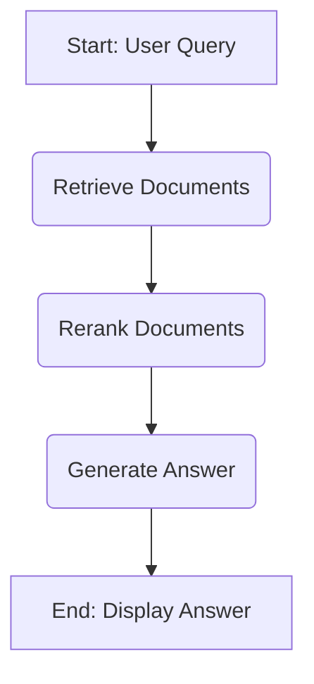

## Boosting Your AI's Brainpower: Adding Reranking to LangGraph Hybrid Search RAG

Imagine you're asking a super-smart robot a question. This robot needs to find the best answer from many books. Sometimes, it finds a lot of books that seem good, but only a few are truly perfect. This is where reranking comes in handy for your AI.

Today, we're going to explore how to make your AI even smarter. We will learn about adding a special step called "reranking" to your LangGraph hybrid RAG system. This helps your AI pick the very best information using tools like Cohere and smart cross-encoders. Get ready to build a much more accurate and helpful AI assistant!

### What is RAG and Why it Matters?

RAG stands for Retrieval Augmented Generation. Think of it like giving your AI a research assistant. When you ask the AI a question, it first "retrieves" (finds) information from a big library of documents.

After finding the information, the AI then "generates" (creates) an answer based on what it found. This makes your AI's answers much more accurate and less likely to make things up. It’s a powerful way to make AIs reliable.

This process is super important for many smart applications you might build. It ensures your AI is always working with real facts. You can learn more about building RAG applications in this useful guide: [Build RAG Applications LangChain Vector Store 2026]().

### The Power of Hybrid Search

Now, let's talk about finding those documents in the first place. Imagine you're looking for information in a giant library. You could search for keywords, like looking for "Mars exploration." This is like traditional keyword search.

But what if you wanted to find documents about "traveling to the red planet" without using the exact word "Mars"? This is where semantic search comes in. It understands the meaning behind your words, not just the words themselves. Hybrid search combines both keyword and semantic search.

This means your AI gets the best of both worlds, finding relevant documents even if they don't use your exact words. It's like having two super-efficient librarians working together. You can dive deeper into this topic with our guide on [LangChain Weaviate Hybrid Search Scalable RAG]().

#### Practical Example: Hybrid Search in Action

Let's say you're building a RAG system about space. If you search for "AI tools for space travel," a simple keyword search might only find documents with "AI tools" and "space travel" mentioned together. It could miss articles that talk about "machine learning applications in aeronautics" or "automated systems for galactic journeys."

A semantic search would understand the meaning and find those related documents. By combining both, a hybrid search ensures you catch everything. This powerful retrieval pipeline gives your AI a wide range of relevant documents to start with. It's crucial for getting a comprehensive initial set of results.

### Introducing LangGraph for Building Smart Agents

LangGraph is like a blueprint for building complex AI systems. It lets you define a series of steps your AI should take, like a flowchart. You can tell your AI to first search, then think, then ask for more information if needed.

It's excellent for creating multi-step AI agents that can handle difficult tasks. Instead of a single AI action, LangGraph allows for dynamic, interactive processes. This makes your AI much more capable and adaptable. You can learn how to set up these smart workflows in our detailed article: [LangGraph StateGraph Multi-Step AI Agent]().

#### How LangGraph Helps in RAG

In a RAG system, LangGraph can manage the entire flow. It can decide when to retrieve documents, when to use a reranking layer, and when to generate an answer. This gives you fine-tuned control over your retrieval pipeline.

For example, your LangGraph agent might retrieve documents, then check if they're good enough. If not, it could decide to refine the search or ask you for clarification. This makes the whole process very smart and efficient. It's a great way to ensure your LangGraph hybrid RAG reranking system is robust.

### Why We Need Reranking in Our RAG Pipeline

Even with excellent hybrid search, your AI might retrieve dozens of documents. Not all of these documents will be equally helpful for answering the question. Some might be slightly related, while others are perfectly on point.

Sending too many documents to the AI can confuse it, make it slower, and even cost more money. This is where a reranking layer becomes essential. It acts like a super-smart filter, picking only the very best documents from the initial set.

The reranking layer ensures that the most relevant information always gets prioritized. This improves the quality of the final answer your AI generates. It's a crucial step in optimizing your retrieval pipeline.

### Deep Dive into Cohere Rerank

CohereRerank is a powerful tool designed specifically for this job. It's like a highly trained expert who can quickly scan through many documents. Then, it ranks them from most to least relevant to your question.

CohereRerank doesn't just look for keywords; it understands the full meaning and context. This allows it to identify subtle connections that other search methods might miss. By using CohereRerank, you ensure only the most precise information reaches your AI's final brain.

#### How CohereRerank Works

When you send a list of documents and your question to CohereRerank, it compares each document to the question. It assigns a score to each document, indicating how well it answers your query. Documents with higher scores are considered more relevant.

This process significantly improves the quality of the documents used by your AI. It acts as a powerful form of contextual compression. This means your AI gets more meaningful information with fewer words.

Consider this example:
*   **Query:** "Best practices for sustainable farming."
*   **Initial Documents (from hybrid search):**
    1.  "Guide to Organic Gardening" (score 0.7)
    2.  "The History of Agriculture" (score 0.2)
    3.  "Advanced Crop Rotation Techniques for Eco-Friendly Farms" (score 0.95)
    4.  "Economic Impact of Farming" (score 0.4)

CohereRerank would likely score document 3 highest, followed by document 1. Documents 2 and 4, while related to farming, are less directly relevant to "sustainable farming best practices." This intelligent sorting ensures the LangGraph hybrid RAG reranking process is highly effective.

### Understanding Cross-Encoders for Better Relevance

Cross-encoders are another fantastic way to improve reranking. Unlike traditional methods that look at a query and a document separately, cross-encoders look at them *together*. They consider how the question and the document relate to each other as a pair.

Imagine you have a question and two possible answers. A cross-encoder would read the question and the first answer, then read the question and the second answer. It then decides which pair makes more sense or is more relevant. This combined understanding makes them incredibly accurate.

#### How Cross-Encoders Work Their Magic

When you feed a query and a document pair to a cross-encoder, it generates a score. This score tells you how relevant the document is to that specific query. The higher the score, the better the match.

This deep, pairwise analysis helps to capture complex relationships and nuances in language. It's a key component in a sophisticated reranking layer. This approach leads to highly precise contextual compression, focusing on the core relevance.

Consider this small example:
*   **Query:** "What are the benefits of eating apples?"
*   **Document 1:** "Apples are a fruit. They grow on trees."
*   **Document 2:** "Eating apples can boost your immune system and provide fiber."

A cross-encoder would likely give a much higher relevance score to Document 2 when paired with the query. This is because it understands the query asks about "benefits," and Document 2 directly provides them. Document 1, while about apples, doesn't address the "benefits" aspect.

### Building Your LangGraph Hybrid Search RAG with Reranking

Now, let's put all these pieces together. We're going to design a smart workflow using LangGraph that incorporates hybrid search and a powerful reranking layer. This will create a top-notch LangGraph hybrid RAG reranking system.

The overall idea is simple: find many documents, then carefully select the best ones before asking the AI to answer. This ensures the AI always gets the most accurate and concise information. You'll see how this structured approach enhances your retrieval pipeline.

#### Designing the LangGraph Workflow

Your LangGraph workflow will have a few key steps or "nodes." Each node does a specific job, and they pass information to each other. Think of it like an assembly line for answering questions.

Here's a simple sketch of how your LangGraph might look:



*   **Retrieve Documents Node:** This is where our hybrid search happens. It fetches many documents.
*   **Rerank Documents Node:** Here, CohereRerank or a cross-encoder filters and sorts the retrieved documents.
*   **Generate Answer Node:** The AI uses the top-ranked documents to create the final answer.

This structured approach, managed by LangGraph, makes your RAG system much more robust. You can explore creating such state machines in more detail in our article: [LangGraph StateGraph Multi-Step AI Agent]().

#### Implementing Hybrid Search in LangGraph

The first step in your LangGraph workflow is to retrieve documents. You can use LangChain's powerful integration with various vector stores for this. For a hybrid approach, Weaviate is an excellent choice.

You would define a "tool" or a function within your LangGraph agent that performs this hybrid search. This function will take the user's query and return a list of potentially relevant documents. This ensures your retrieval pipeline is robust from the start.

Here’s a conceptual snippet of how a retriever might look:



``` python
from langchain_community.vectorstores import Weaviate
from langchain_community.embeddings import OpenAIEmbeddings
from langchain.retrievers import WeaviateHybridSearchRetriever

# Assume Weaviate client and embeddings are already set up
# For full setup, refer to: 

# This would be part of your LangGraph 'retrieve' node
def retrieve_documents(state):
    query = state["question"]
    # Example retriever setup (needs actual client, index_name, etc.)
    vectorstore = Weaviate.from_existing_index(
        embedding=OpenAIEmbeddings(), # Replace with your actual embeddings
        index_name="YourRAGIndex",
        weaviate_url="http://localhost:8080" # Replace with your Weaviate URL
    )
    retriever = WeaviateHybridSearchRetriever(
        vectorstore=vectorstore,
        alpha=0.5, # Adjust alpha for hybrid balance
        k=50 # Retrieve more documents initially for reranking
    )
    docs = retriever.invoke(query)
    return {"documents": docs}

# The 'state' in LangGraph would carry the 'question'
# and the output would update the 'documents' list
```



This code shows how you might set up a retriever to fetch a larger initial set of documents. This larger set is then ready for the next crucial step: reranking. It forms the backbone of your retrieval pipeline.

#### Integrating the Reranking Layer

Once you have your initial documents from the hybrid search, the next step is to refine them. This is where the reranking layer comes into play. You'll add a node to your LangGraph that takes these documents and applies a reranker.

You can use CohereRerank directly as a component in your LangChain/LangGraph setup. Or, you could integrate a custom cross-encoder model if you prefer. This step is critical for contextual compression. It ensures your AI only processes the most focused and relevant information.

Here’s an example of how you might integrate CohereRerank:


```python
from langchain.retrievers import ContextualCompressionRetriever
from langchain.retrievers.document_compressors import CohereRerank

# Assume the initial retriever and Cohere API key are set up
# For a full example, you'd define this in your LangGraph node

def rerank_documents(state):
    query = state["question"]
    documents = state["documents"] # Documents from the retrieve_documents node

    # Initialize CohereRerank compressor
    # Make sure COHERE_API_KEY environment variable is set
    compressor = CohereRerank(
        model="rerank-english-v3.0", # Or other suitable Cohere model
        top_n=10 # Keep only the top 10 most relevant documents
    )
    
    # Use ContextualCompressionRetriever for easy integration
    # This expects a base_retriever, but we can simulate it with existing docs
    # If directly within a LangGraph node, you might just call compressor.compress_documents
    
    # Simulate a retriever to use with ContextualCompressionRetriever for compression logic
    # In a real LangGraph setup, you might call compressor.compress_documents directly
    
    # Simplified direct compression for LangGraph node
    compressed_docs = compressor.compress_documents(documents, query)
    
    return {"documents": compressed_docs}

# The 'documents' in the state would now be the top_n reranked documents.
```


In this `rerank_documents` function, the `CohereRerank` model takes your initial documents and your original query. It then returns only the `top_n` most relevant ones. This dramatically reduces the noise and ensures high-quality input for the generation step. This is a perfect example of a powerful reranking layer.

##### Contextual Compression: Getting More from Less

The reranking step is not just about sorting; it's also about contextual compression. By selecting only the `top_n` most relevant documents, you significantly reduce the amount of text your AI has to read. This is extremely beneficial for several reasons.

Firstly, it helps you stay within the "context window" limits of large language models (LLMs). Secondly, less text means faster processing and often lower API costs. Finally, and most importantly, it leads to more focused and accurate answers from your AI. The AI isn't distracted by less important information.

### Practical Example: A Question-Answering Bot with Reranking

Let's walk through a more complete example of how to build a LangGraph hybrid RAG reranking bot. This bot will answer questions by first searching a document store, then carefully picking the best results, and finally generating an answer. This system highlights the effectiveness of a robust retrieval pipeline.

#### Setting up Your Environment

First, you'll need to install the necessary libraries. Make sure you have your API keys for Cohere and OpenAI (or other LLM provider) ready.


```bash
pip install -U langchain langgraph cohere weaviate-client openai pydantic
```


You'll also need to set up your environment variables for API keys:


```bash
export COHERE_API_KEY="YOUR_COHERE_API_KEY"
export OPENAI_API_KEY="YOUR_OPENAI_API_KEY" # Or equivalent for your chosen LLM
```


#### The Hybrid Retriever

For our example, we'll use Weaviate as our vector store for hybrid search. This ensures a comprehensive initial retrieval. We'll set up a retriever that can handle both keyword and semantic searches.


```python
from langchain_community.vectorstores import Weaviate
from langchain_openai import OpenAIEmbeddings # Using OpenAI for embeddings
from langchain.retrievers import WeaviateHybridSearchRetriever
import os
import weaviate

# Setup Weaviate client (replace with your actual client setup)
# For local Weaviate, you might run it via Docker
# For cloud Weaviate, use your cluster URL and API key
auth_config = weaviate.auth.AuthApiKey(api_key=os.environ.get("WEAVIATE_API_KEY"))
client = weaviate.Client(
    url=os.environ.get("WEAVIATE_URL", "http://localhost:8080"),
    auth_client_secret=auth_config
)

# Initialize embeddings
embeddings = OpenAIEmbeddings()

# Set up the Weaviate vector store
vectorstore = Weaviate(
    client=client,
    index_name="MyRAGDocs", # Your Weaviate collection name
    text_key="content",
    embedding=embeddings,
    by_text=False # We handle embeddings explicitly
)

# Create the hybrid retriever
# We set k=50 to retrieve more documents than we need,
# so the reranker has a good pool to select from.
weaviate_retriever = WeaviateHybridSearchRetriever(
    vectorstore=vectorstore,
    alpha=0.5,  # Blend factor for hybrid search (0.0 = keyword, 1.0 = semantic)
    k=50,       # Number of documents to retrieve initially
    ensemble_k=10 # Number of documents for keyword search
)
```


This `weaviate_retriever` is the heart of your initial retrieval pipeline. It will fetch a broad set of documents that are potentially relevant to the user's query. Remember, you can find more details on setting up Weaviate for hybrid search here: [LangChain Weaviate Hybrid Search Scalable RAG]().

#### Adding the Cohere Rerank Model

Next, we integrate the CohereRerank into our system. This will act as our reranking layer, selecting the best documents.


```python
from langchain.retrievers.document_compressors import CohereRerank
from langchain.retrievers import ContextualCompressionRetriever

# Initialize CohereRerank compressor
cohere_rerank_compressor = CohereRerank(
    model="rerank-english-v3.0",
    top_n=5 # We want to keep only the top 5 most relevant documents after reranking
)

# This is a convenience wrapper; in LangGraph, we might use the compressor directly
compression_retriever = ContextualCompressionRetriever(
    base_compressor=cohere_rerank_compressor,
    base_retriever=weaviate_retriever
)
```


Here, `cohere_rerank_compressor` will take the documents found by our hybrid retriever. It then uses the Cohere model to score them against the original query. Finally, it keeps only the `top_n` highest-scoring documents. This is a powerful step for contextual compression and improved accuracy in your LangGraph hybrid RAG reranking system.

#### Building the LangGraph Agent

Now, let's assemble our LangGraph agent. We'll define the "state" of our agent (what information it carries), its nodes (the steps), and its edges (how it moves between steps). This creates a flexible and intelligent retrieval pipeline.


```python
from typing import List
from langgraph.graph import StateGraph, END
from langchain_core.documents import Document
from langchain_core.messages import BaseMessage, HumanMessage
from langchain_openai import ChatOpenAI
from langchain_core.prompts import ChatPromptTemplate

# Define the Agent State
class AgentState(dict):
    question: str
    documents: List[Document] = []
    answer: str = ""

# Define the Nodes
def retrieve_node(state: AgentState):
    print("---RETRIEVE---")
    question = state["question"]
    # Use the base weaviate_retriever to get initial documents
    initial_docs = weaviate_retriever.invoke(question)
    return {"documents": initial_docs}

def rerank_node(state: AgentState):
    print("---RERANK---")
    question = state["question"]
    documents = state["documents"]
    
    # Use the CohereRerank compressor directly
    reranked_docs = cohere_rerank_compressor.compress_documents(documents, question)
    return {"documents": reranked_docs}

def generate_node(state: AgentState):
    print("---GENERATE---")
    question = state["question"]
    documents = state["documents"]
    
    # Create a prompt for the LLM
    prompt = ChatPromptTemplate.from_messages(
        [
            ("system", "You are a helpful AI assistant. Answer the user's question based ONLY on the provided context. If you cannot find the answer in the context, state that you don't know."),
            ("human", "Question: {question}\n\nContext:\n{context}"),
        ]
    )
    
    # Prepare the context for the LLM
    context_str = "\n\n".join([doc.page_content for doc in documents])
    
    # Initialize the LLM (e.g., OpenAI's GPT-4)
    llm = ChatOpenAI(model="gpt-4", temperature=0)
    
    # Create the RAG chain
    rag_chain = prompt | llm 
    
    # Invoke the chain with context and question
    response = rag_chain.invoke({"question": question, "context": context_str})
    
    return {"answer": response.content}

# Build the LangGraph
workflow = StateGraph(AgentState)

# Add nodes
workflow.add_node("retrieve", retrieve_node)
workflow.add_node("rerank", rerank_node)
workflow.add_node("generate", generate_node)

# Set the entry point
workflow.set_entry_point("retrieve")

# Define edges
workflow.add_edge("retrieve", "rerank")
workflow.add_edge("rerank", "generate")
workflow.add_edge("generate", END) # The last node finishes the graph

# Compile the graph
app = workflow.compile()
```


This code sets up our LangGraph. The agent will start by retrieving documents, then rerank them, and finally generate an answer. This clear flow demonstrates the benefits of a structured approach to building a LangGraph hybrid RAG reranking system. You can explore creating complex agents in more detail by checking out: [LangGraph StateGraph Multi-Step AI Agent]().

#### Putting It All Together: The Full Code (Conceptual Flow)

To run this, you would simply invoke the compiled LangGraph application with a question.


```python
# To run this, you would first need to have data indexed in your Weaviate instance.
# For example, you could index some dummy data:
# from langchain.docstore.document import Document
# docs_to_index = [
#     Document(page_content="Apples are good for health and provide fiber.", metadata={"source": "nutrition"}),
#     Document(page_content="The history of farming started thousands of years ago.", metadata={"source": "history"}),
#     Document(page_content="Sustainable farming practices include crop rotation and organic fertilizers.", metadata={"source": "agriculture"}),
#     Document(page_content="Space exploration requires advanced AI tools for navigation.", metadata={"source": "space"}),
#     Document(page_content="Machine learning is a subset of AI.", metadata={"source": "ai"})
# ]
# vectorstore.add_documents(docs_to_index) # Add documents to Weaviate

# Example usage of the compiled app
question = "What are the key practices for sustainable agriculture?"
result = app.invoke({"question": question})

print("\n---FINAL ANSWER---")
print(result["answer"])

# Another example
question_2 = "Tell me about the health benefits of apples."
result_2 = app.invoke({"question": question_2})
print("\n---FINAL ANSWER---")
print(result_2["answer"])
```


This comprehensive example illustrates the full power of combining LangGraph, hybrid search, and a reranking layer. It shows how a query moves through the retrieval pipeline, gets refined, and then leads to a precise answer. This is the essence of a well-designed LangGraph hybrid RAG reranking system.

### Benefits of LangGraph Hybrid RAG Reranking

Implementing a reranking layer in your LangGraph hybrid RAG system offers several significant advantages. It transforms a good RAG system into an exceptional one. You'll notice improved performance across the board.

*   **More Accurate Answers:** By ensuring the AI only sees the most relevant documents, you drastically reduce the chance of it providing incorrect or off-topic information. The reranking layer truly elevates answer quality.
*   **Better Use of AI Context Window:** Reranking acts as a powerful contextual compression technique. It means you send fewer, but higher-quality tokens to your LLM. This makes your AI more efficient.
*   **Faster Responses:** With less noise and more focused context, the LLM can process information quicker and generate answers faster. This improves the user experience significantly.
*   **More Reliable RAG:** The entire retrieval pipeline becomes more robust and dependable. You have greater confidence that your AI is operating on the best possible information.
*   **Cost Efficiency:** Sending less irrelevant data to expensive LLM APIs can lead to noticeable cost savings, especially at scale. Contextual compression is key here.

### Challenges and Future Improvements

While adding reranking offers immense benefits, there are a few things to consider. Selecting the right reranking model is important; CohereRerank is excellent, but other cross-encoder models might also fit specific needs. You might even want to fine-tune your own.

The cost of API calls for reranking should also be monitored, especially with very high document counts. Balancing speed and accuracy is a continuous process. You can experiment with the `top_n` parameter in `CohereRerank` to find the sweet spot for your application.

Future improvements could involve dynamically adjusting the `top_n` based on the query complexity or even chaining multiple reranking steps. Another area for exploration is using different semantic text splitting strategies, as discussed in [LangChain Semantic Text Splitter Chunk by Meaning](), which can make the initial documents even better for reranking.

### Conclusion

You've now seen how adding a powerful reranking layer significantly improves your LangGraph hybrid RAG system. By leveraging tools like CohereRerank and the intelligence of cross-encoders, your AI can find, sort, and utilize information with much greater precision. This process of LangGraph hybrid RAG reranking ensures your AI delivers highly accurate and relevant answers.

This smart enhancement leads to a more efficient and reliable retrieval pipeline. It's a critical step in building truly intelligent and capable AI applications. So go ahead, experiment with these techniques, and unleash the full potential of your RAG systems!